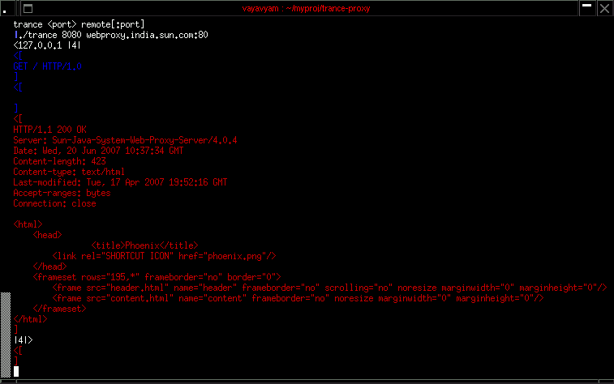

Trance is a simple tcp proxy to be used as a debugging tool (Like the SSLTap from mozilla), It prints the communication at both ends to the console in color. It is a poll based server and thus supports multiple simultaneous clients (unlike SSLTap.) My plan is to make it like the inetd so as to allow piping of data into an externel program and retrieving it from there for each connection.

